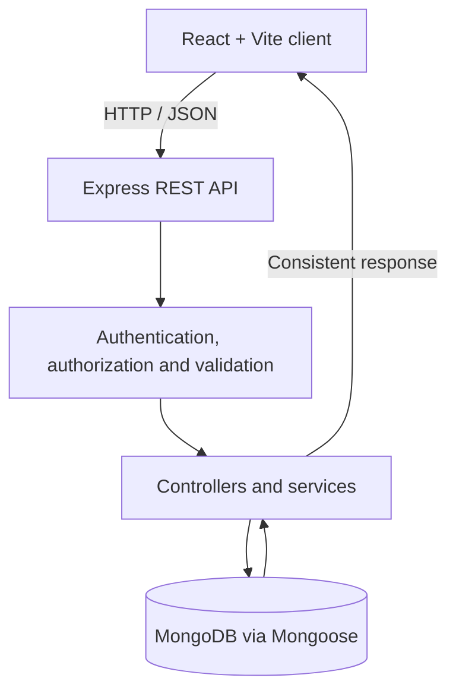

# CampusConnect

A full-stack campus event discovery and administration platform built with the MERN stack. CampusConnect allows students to discover events while giving administrators secure tools to manage events, control platform behaviour, preserve configuration history, and export operational audit reports.

> **Project status:** Core application workflows are implemented and verified locally. Production deployment and CI automation are the remaining release milestones.

## Project highlights

- Built a modular React, Express, and MongoDB application in an npm workspace monorepo.
- Implemented searchable event discovery with compound filters, sorting, date ranges, and pagination.
- Secured administrative workflows with JWT authentication, password hashing, and role-based authorization.
- Added versioned platform configuration with change reasons, immutable history, and restoration.
- Recorded event changes in an immutable operational audit trail with an administrator dashboard, filters, summary metrics, pagination, and CSV reporting.
- Verified the application with **40 automated tests** across models, services, middleware, and HTTP routes.

## Why this project exists

Campus opportunities are often distributed across multiple groups and communication channels. CampusConnect centralizes those events in one searchable application and provides controlled administrative workflows for maintaining reliable event data.

The project also demonstrates production-oriented software-engineering practices beyond basic CRUD:

- layered backend architecture;
- validated environment configuration;
- authorization at API boundaries;
- consistent error contracts;
- configuration versioning and recovery;
- operational traceability;
- automated quality checks.

## Features

### Student experience

- Browse and view campus events
- Search titles, descriptions, organizers, and tags
- Filter by category, publication status, and date range
- Sort results and navigate paginated collections
- Open registration links from event details
- View responsive loading, empty, and error states
- Register and sign in as an attendee

### Administrator experience

- Create, edit, and delete events through protected APIs and administrator interfaces
- Reuse validated form workflows for event creation and editing
- Access protected event-management, configuration, and audit interfaces
- Publish validated platform configuration changes
- Enable or disable event submissions
- Control registration visibility and default page size
- Supply a reason for every configuration change
- Restore an earlier configuration as a new version
- Download configuration history as CSV
- Review filtered event-change records through the operational audit dashboard
- Monitor created, updated, deleted, and total action counts
- Navigate paginated audit history and download operational audit data as CSV

### Reliability and security

- Password hashing with bcrypt
- Signed JWT authentication
- Attendee and administrator roles
- Route-level authorization
- Helmet security headers and configurable CORS
- Centralized error handling
- Request and query validation
- Environment-based secrets
- Database-aware health endpoint
- Immutable configuration and audit records

## Architecture



The server follows a layered request flow:

1. Routes define endpoints and middleware.
2. Middleware authenticates users and validates input.
3. Controllers translate HTTP requests into domain operations.
4. Services implement business rules and database interactions.
5. Mongoose models enforce persistent data constraints.
6. Centralized middleware returns consistent errors.

Detailed design notes are available in [docs/architecture.md](docs/architecture.md), and the complete endpoint contract is documented in [docs/api.md](docs/api.md).

## Technology stack

| Layer | Technologies |
| --- | --- |
| Frontend | React 19, Vite 7, JavaScript, CSS |
| Backend | Node.js, Express 5, REST APIs |
| Database | MongoDB, Mongoose |
| Authentication | JSON Web Tokens, bcryptjs |
| Security and logging | Helmet, CORS, Morgan |
| Testing | Vitest, Supertest |
| Code quality | ESLint |
| Project structure | npm workspaces, Git, GitHub |

## Repository structure

```text
Campus-Link/
├── client/
│   └── src/
│       ├── api/             # Browser API clients
│       ├── components/      # Reusable interface components
│       ├── config/          # Client environment access
│       └── pages/           # Discovery, authentication and admin pages
├── server/
│   ├── src/
│   │   ├── config/          # Environment and database configuration
│   │   ├── controllers/     # HTTP request handlers
│   │   ├── middleware/      # Validation, security and error handling
│   │   ├── models/          # Mongoose schemas
│   │   ├── routes/          # REST route definitions
│   │   ├── scripts/         # Administrator seeding
│   │   ├── services/        # Business and persistence logic
│   │   └── utils/           # Shared server utilities
│   └── tests/               # Model, service and route tests
├── docs/
│   ├── api.md
│   └── architecture.md
└── package.json             # Workspace scripts
```

## API overview

Base URL during local development: `http://localhost:5000/api`

| Area | Endpoints | Access |
| --- | --- | --- |
| Health | `GET /health` | Public |
| Authentication | `POST /auth/register`, `POST /auth/login`, `GET /auth/me` | Mixed |
| Events | `GET /events`, `GET /events/:id` | Public |
| Event management | `POST /events`, `PUT /events/:id`, `DELETE /events/:id` | Admin |
| Configuration | `GET /config` | Public |
| Configuration management | `PUT /config`, history, restore, CSV export | Admin |
| Operational audit | history, summary, CSV export under `/audit` | Admin |

Example discovery request:

```http
GET /api/events?search=cloud&category=workshop&status=published&sort=eventDate&order=asc&page=1&limit=10
```

## Local setup

### Prerequisites

- Node.js 22.12 or newer
- npm 10 or newer
- MongoDB Community Server or MongoDB Atlas

### 1. Clone and install

```bash
git clone https://github.com/Anjalisingh127/Campus-Link.git
cd Campus-Link
npm install
```

### 2. Create environment files

PowerShell:

```powershell
Copy-Item client\.env.example client\.env
Copy-Item server\.env.example server\.env
```

Bash:

```bash
cp client/.env.example client/.env
cp server/.env.example server/.env
```

Update the local files with your database connection, client origin, and a long random JWT secret. Actual `.env` files are ignored by Git.

Important environment variables:

| File | Variable | Purpose |
| --- | --- | --- |
| `client/.env` | `VITE_API_BASE_URL` | API base path or deployed API URL |
| `server/.env` | `MONGODB_URI` | MongoDB connection string |
| `server/.env` | `CLIENT_ORIGIN` | Allowed browser origin |
| `server/.env` | `JWT_SECRET` | JWT signing secret |
| `server/.env` | `JWT_EXPIRES_IN` | Token lifetime |
| `server/.env` | `ADMIN_EMAIL` | Administrator seeding email |
| `server/.env` | `ADMIN_PASSWORD` | Temporary administrator seeding password |

Never place database credentials or JWT secrets in the client environment.

### 3. Seed an administrator

Set an administrator email and a password of at least 12 characters in `server/.env`, then run:

```bash
npm run seed:admin --workspace server
```

After the account is created, remove `ADMIN_PASSWORD` from `server/.env`. The stored database value is a bcrypt hash, not the plaintext password.

### 4. Run the application

```bash
npm run dev
```

- Client: [http://localhost:5173](http://localhost:5173)
- API: [http://localhost:5000](http://localhost:5000)
- Health check: [http://localhost:5000/api/health](http://localhost:5000/api/health)

## Quality checks

Run the complete local verification pipeline:

```bash
npm run check
```

This command executes:

1. ESLint across both workspaces
2. Vitest and Supertest test suites
3. Vite production build

Current verified result:

```text
Test files: 7 passed
Tests:      40 passed
Build:      successful
```

## Configuration recovery workflow

Configuration changes are not overwritten in place. Each update creates an immutable version containing:

- the validated settings snapshot;
- the administrator identity;
- the change reason;
- the action and timestamp;
- the source version when restored.

Restoring a version creates another new version, preserving the complete history.

## Operational audit workflow

Successful administrator event mutations create audit records for:

- `event.created`
- `event.updated`
- `event.deleted`

Each record preserves the event identity, administrator snapshot, timestamp, action description, and relevant metadata. Audit history supports action/date filters, pagination, summary counts, and CSV export.

## Error contract

API failures use a consistent structure:

```json
{
  "error": {
    "code": "VALIDATION_ERROR",
    "message": "Request validation failed",
    "details": [
      {
        "field": "title",
        "message": "title is required"
      }
    ]
  }
}
```

## Engineering decisions

- **Workspace monorepo:** keeps client and server development synchronized.
- **Layered backend:** separates transport, validation, business logic, and persistence.
- **Server-side discovery:** keeps filtering and pagination scalable beyond browser memory.
- **RBAC at the API layer:** prevents client-side route protection from becoming the only security boundary.
- **Immutable history:** supports traceability and recovery without destroying earlier records.
- **Environment separation:** prevents secrets and deployment-specific values from entering source control.
- **Tested failure paths:** validates unauthorized access, invalid queries, missing records, and disabled submissions.

## Roadmap

- GitHub Actions continuous integration
- Production deployment and smoke testing
- Final screenshots and live demonstration documentation

## Author

**Anjali Singh**  
B.Tech Computer Science and Engineering, 2026

- [GitHub](https://github.com/Anjalisingh127)
- [LinkedIn](https://www.linkedin.com/in/anjalisingh-as12)

---

This repository is developed as a practical full-stack software-engineering project. Features and metrics are documented only after implementation and verification.
